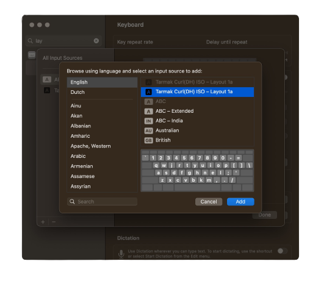
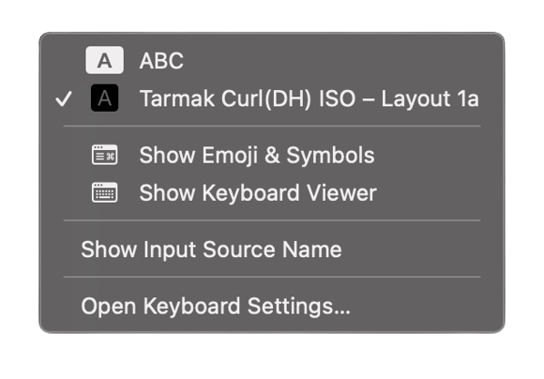

⌨️ Migrating to Colemak DH using the Tarmak DH layouts
###

To install this layout, copy the bundle to the following location:

```
cp -R ./layouts/Tarmak\ Curl\(DH\)\ ISO\ –\ Layout\ 1a.bundle /Library/Keyboard\ Layouts
```

Restart your machine. 
Add the layout to the list of available layouts in the Keyboard > Layout preferences pane.



You can then switch to the layout using the keyboard menu bar item.



---

Thanks for:

* [Ukelele](https://software.sil.org/ukelele/) which was used to create the layout keyboard bundle.
* Based on the guide at:
[https://dreymar.colemak.org/tarmak-steps.html#tmk-dh](https://dreymar.colemak.org/tarmak-steps.html#tmk-dh)
